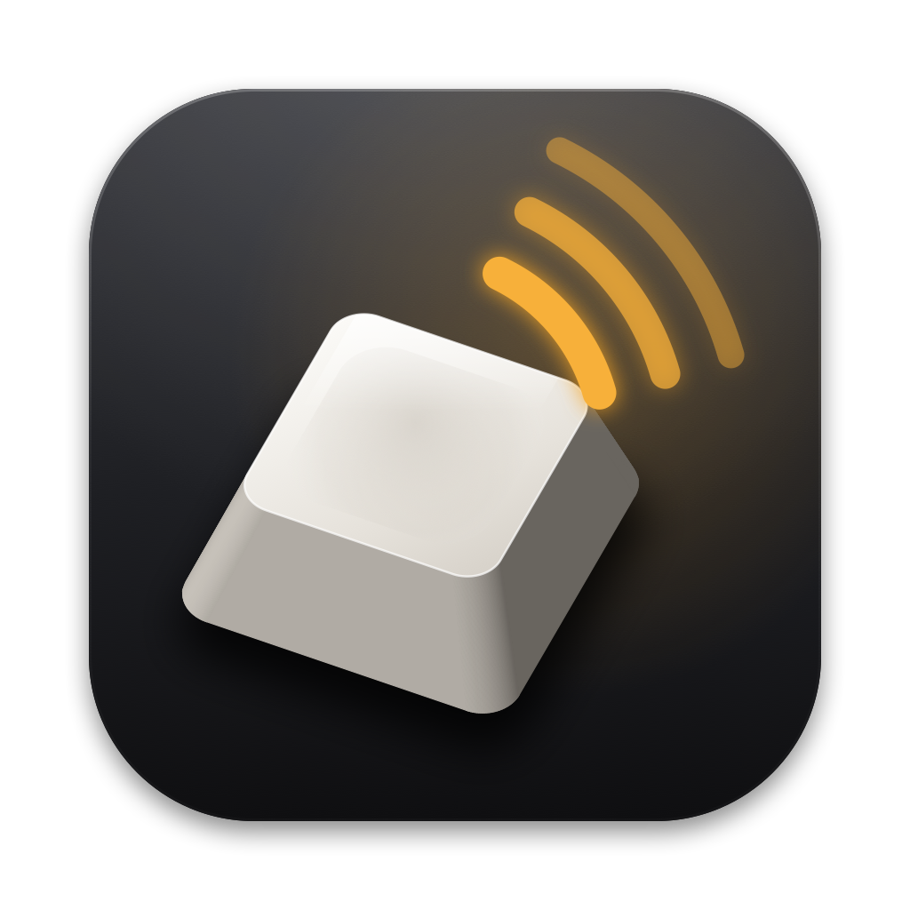
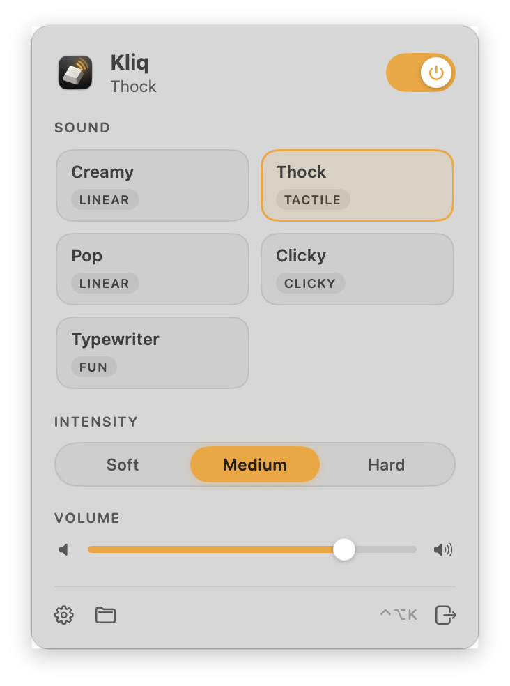
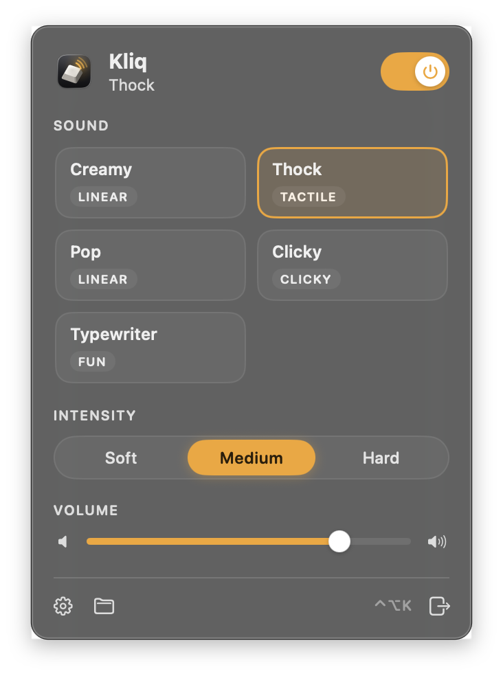
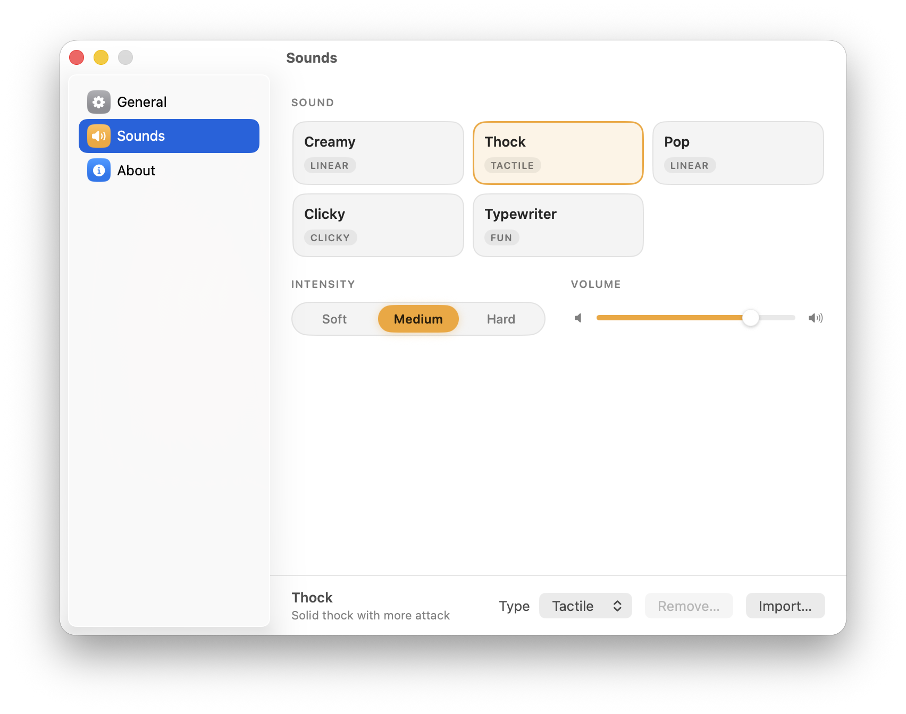
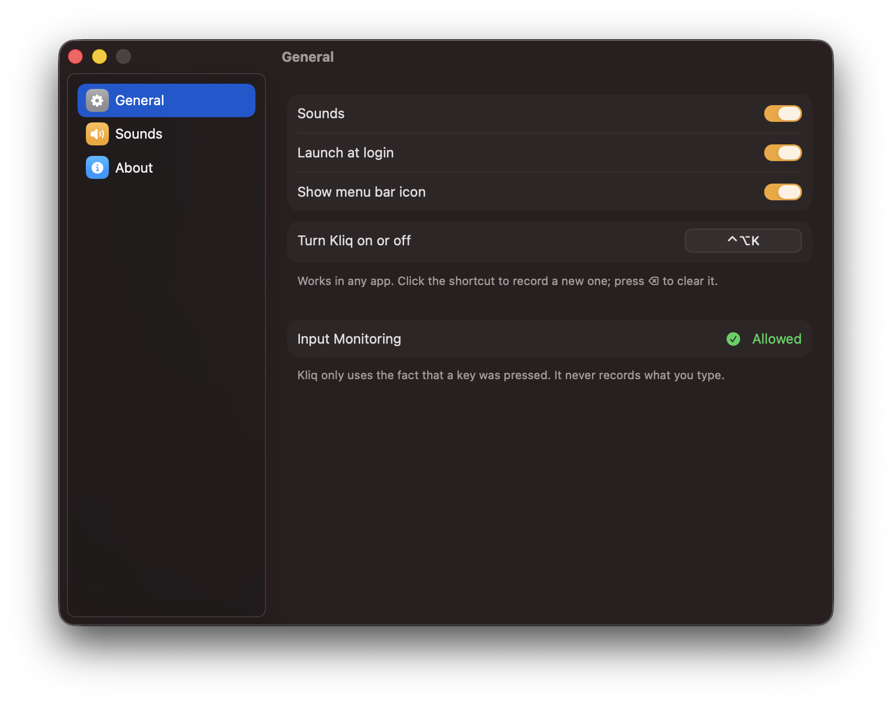
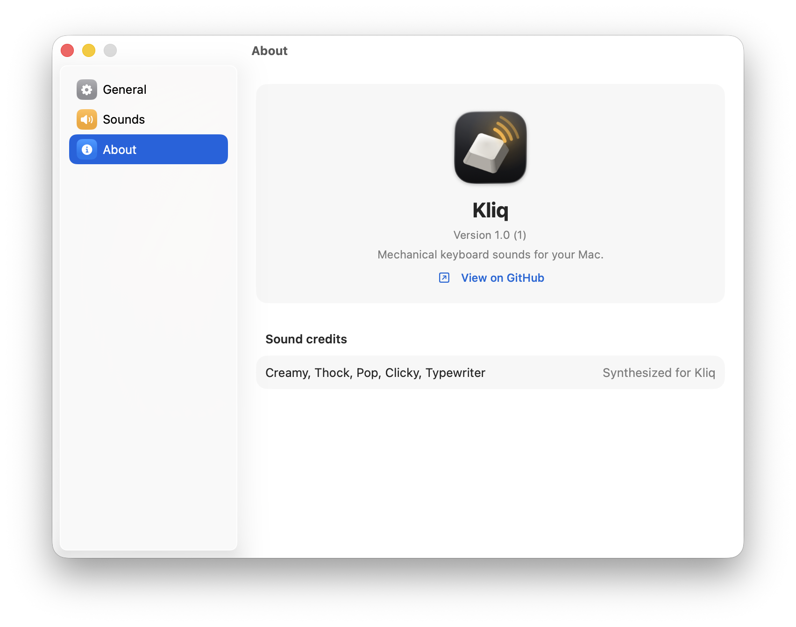

<p align="center">
  
</p>

<h1 align="center">Kliq</h1>

<p align="center">
  Free, open-source mechanical keyboard sounds for your Mac.<br>
  A tiny menu bar app: every key you press plays a satisfying click, thock or clack.
</p>

<p align="center">
  <a href="https://github.com/6vansh9/kliq/releases/latest"></a>
</p>

<p align="center">
  macOS 13 or later &nbsp;·&nbsp; Apple Silicon and Intel &nbsp;·&nbsp; Free and open source (MIT)
</p>

## What is Kliq?

Kliq is a lightweight menu bar app that plays realistic mechanical keyboard sounds as you type, in any app. It sits quietly in your menu bar, doesn't record what you type, and you can switch it on or off with a shortcut.

## Why I made it

Apps like Haptyk offer this experience as a paid product. So I built my own version and made it completely free and open source, for everyone.

Kliq is *inspired by* Haptyk, but it isn't the same app. For example, Kliq uses fixed intensity levels (Soft, Medium, Hard) that you pick yourself, rather than detecting how hard you press each key.

| Light | Dark |
|---|---|
|  |  |

<p align="center">
  
</p>

## Features

- **Five built-in sounds:** Creamy, Thock, Pop, Clicky and Typewriter, all synthesized for Kliq.
- **Every key has its own sound.** Press the same key twice and it sounds the same (with a tiny natural variation in pitch and volume, so it never sounds robotic). Space, Return and friends get a heavier sound.
- **Intensity:** Soft, Medium or Hard. Soft is quieter and duller, Hard is louder and fuller.
- **Bring your own sounds:** import any [Mechvibes](https://mechvibes.com/sound-packs) sound pack, with per-key sounds and optional key-release sounds.
- **Stays out of the way:** lives in the menu bar, turns on and off with **⌃⌥K** from any app, and can launch at login.
- **Private:** never uses the microphone, makes no network connections and doesn't record what you type. It only uses the fact that a key was pressed.
- Native SwiftUI, light and dark mode, and it respects Reduce Motion.

## Install

1. **Download** `Kliq.zip` from the [latest release](https://github.com/6vansh9/kliq/releases/latest) and unzip it.
2. **Drag `Kliq.app` into Applications.**
3. **Open it the first time.** Kliq is free and not from the App Store, so macOS blocks it on first launch:
   - Double-click Kliq. macOS says it can't verify the app. Click **Done** (don't move it to the Trash).
   - Open **System Settings → Privacy & Security**, scroll down to *"Kliq was blocked…"* and click **Open Anyway**. Enter your password and click **Open Anyway** again.
4. **Allow Input Monitoring.** Kliq needs it to know when you press a key. When macOS asks, click **Open System Settings** (or go to **Privacy & Security → Input Monitoring**) and turn on **Kliq**. If macOS offers **Quit & Reopen**, click it.
5. Start typing. Click the keycap icon in the menu bar to pick a sound.

To uninstall: quit Kliq, delete it from Applications, and remove it from Privacy & Security → Input Monitoring.

## Using Kliq

Click the keycap icon in the menu bar (filled when on, outlined when off):

- **Power switch** turns the sounds on or off.
- **Sound cards:** click one to use it, hover and click ▶ to preview it, right-click to change its tag (Clicky, Tactile, Linear or Fun).
- **Intensity** and **Volume**.
- **Footer:** Settings, the profiles folder, and Quit.

The **Settings** window (gear icon, or open Kliq again from Applications) has:

- **General:** launch at login, show or hide the menu bar icon, and the on/off shortcut (click it to record a new one, ⌫ clears it).
- **Sounds:** all sounds, plus **Import…** and **Remove…** for your own packs.
- **About:** version and credits for every sound pack.

| General | About |
|---|---|
|  |  |

## Add Mechvibes sound packs

[Mechvibes](https://mechvibes.com/sound-packs) has hundreds of community sound packs recorded from real keyboards. Kliq doesn't ship any of them, but you can add them yourself:

1. Download a pack from [mechvibes.com/sound-packs](https://mechvibes.com/sound-packs). You get a .zip (or a folder) with a `config.json` and audio files.
2. In Kliq, open **Settings → Sounds → Import…** and choose the .zip or folder.
3. The pack appears as a new sound card.

Importing converts the pack with [`tools/import_mechvibes.py`](tools/import_mechvibes.py), so it needs **Python 3 with numpy** and **ffmpeg**:

```sh
brew install ffmpeg
pip3 install numpy
```

You can also run the importer yourself:

```sh
python3 tools/import_mechvibes.py ~/Downloads/<pack folder> ["Name"] [--type clicky|tactile|linear|fun]
```

What it does:

- Reads Mechvibes config v1 and v2 packs, with `single` (one audio file with timings) or `multi` (one file per key) definitions, and decodes them with ffmpeg to 48 kHz mono.
- Exports every distinct key sound, trims leading silence and adds a short fade-out.
- Writes `keymap.json`, the pack's own key-to-sound mapping translated from Mechvibes' PC scan codes to macOS keycodes, so every key keeps the sound the pack gave it.
- Builds the three intensity layers from each original: **Hard** is the original, **Medium** is −6 dB with a gentle 7 kHz low-pass, **Soft** is −14 dB with a steeper 4 kHz low-pass and a softened attack.
- Exports key-release sounds from "full travel" packs as `up_N.wav`. A **Key-up sounds** switch then appears under the sound cards.

Imported packs live in `~/Library/Application Support/Kliq/Profiles/`, one folder each.

> **Licensing:** every Mechvibes pack belongs to its creator and has its own license, or none. The importer copies a pack's `LICENSE.txt` when there is one, and otherwise writes a `PACKS-NOTICE.txt` saying it's for personal use. Imported packs are fine for your own use. Only packs with a clear license that allows it should ever be redistributed, and packs made from game or other copyrighted audio never should be.

## Build from source

You need Xcode 15 or later and [XcodeGen](https://github.com/yonaskolb/XcodeGen). A free Apple ID is enough.

```sh
git clone https://github.com/6vansh9/kliq.git
cd kliq
brew install xcodegen
xcodegen generate
open Kliq.xcodeproj
```

In Xcode, select the **Kliq** target → **Signing & Capabilities** and pick your **Personal Team**, then press **⌘R**. To make the team stick across `xcodegen generate`, copy `Config/Local.xcconfig.example` to `Config/Local.xcconfig` and put your Team ID in it (the file is git-ignored). If Xcode says the bundle identifier isn't available, change `PRODUCT_BUNDLE_IDENTIFIER` in `project.yml`.

From the command line:

```sh
xcodebuild -project Kliq.xcodeproj -scheme Kliq -configuration Release \
  -derivedDataPath build -allowProvisioningUpdates build
open build/Build/Products/Release/Kliq.app
```

To make a shareable build that runs on any Mac (universal, ad-hoc signed, no Apple account needed):

```sh
xcodebuild -project Kliq.xcodeproj -scheme Kliq -configuration Release -derivedDataPath build-dist \
  ARCHS="arm64 x86_64" ONLY_ACTIVE_ARCH=NO CODE_SIGN_STYLE=Manual CODE_SIGN_IDENTITY=- DEVELOPMENT_TEAM= \
  CODE_SIGN_INJECT_BASE_ENTITLEMENTS=NO build
```

Other tools:

| Command | What it does |
|---|---|
| `python3 tools/make_sounds.py` | Regenerates the five built-in sounds (needs numpy) |
| `swift tools/make_icon.swift` | Renders the app icon and `docs/icon-preview.png` |
| `Kliq.app/Contents/MacOS/Kliq -KliqScreenshots <dir>` | Debug builds only: saves the screenshots in `docs/screenshots` |
| `open -a Kliq --args -KliqLaunchAtLogin YES` | Turns launch at login on (or `NO` for off) from the command line |

### Project layout

```
project.yml                  XcodeGen spec (source of truth for Kliq.xcodeproj)
Config/                      Shared signing settings; your Team ID goes in Local.xcconfig
Kliq/Sources/
  KliqApp.swift              App entry point: MenuBarExtra and app delegate
  PopoverView.swift          The menu bar popover
  SettingsWindow.swift       Settings window (General, Sounds, About) and shortcut recorder
  Components.swift           Theme and shared controls: switch, intensity, volume, sound cards
  KliqController.swift       App state and the key → velocity → sound pipeline
  KeyMonitor.swift           Listen-only event tap for key presses
  SoundEngine.swift          Audio output: per-key variants, 12 player nodes with pitch variation
  SoundProfile.swift         Sound folders, type tags and credits
  ProfileImporter.swift      Import and remove sounds from Settings
  HotKey.swift               Global on/off shortcut
  MenuBarIcon.swift          The menu bar icon, drawn in code
  ForceSource.swift          Intensity, and a protocol for a future force sensor
  VelocityMapper.swift       Maps raw force readings to 0–1 (for a future sensor)
  ScreenshotMode.swift       Debug builds only: renders the screenshots
Kliq/Resources/Sounds/       Built-in sounds: <name>/soft_N.wav, medium_N.wav, hard_N.wav
tools/                       Sound synthesizer, Mechvibes importer, icon renderer
docs/                        Icon preview and screenshots
```

## How it works

1. **Key press:** a listen-only event tap reports each key press and its keycode (modifier keys too). The keycode is used only to choose that key's sound and is never logged, stored or saved. Holding a key down doesn't repeat the sound.
2. **Velocity:** every key plays immediately at the chosen Intensity. MacBook keys don't report pressure, so Kliq doesn't guess; the code has a `ForceSource` protocol so a real force sensor could be plugged in later without touching the sound engine.
3. **Sound:** the Intensity picks the soft, medium or hard layer. Each key always gets the same variant: the pack's own mapping if it has one, otherwise the heaviest sound for Space and Return, otherwise `keyCode % variants`. Sounds play on a pool of 12 always-running player nodes, each with a varispeed unit for a random ±1.5% pitch change, and the volume varies by ±5%.

Output device changes (headphones in or out) rebuild the audio engine, and a health check restarts anything that stopped, for example after sleep.

## License

Kliq's code and its built-in sounds are released under the [MIT License](LICENSE). Mechvibes packs you import are not part of Kliq and keep their own licenses.

---

Made by Vansh ([@6vansh9](https://github.com/6vansh9)).
